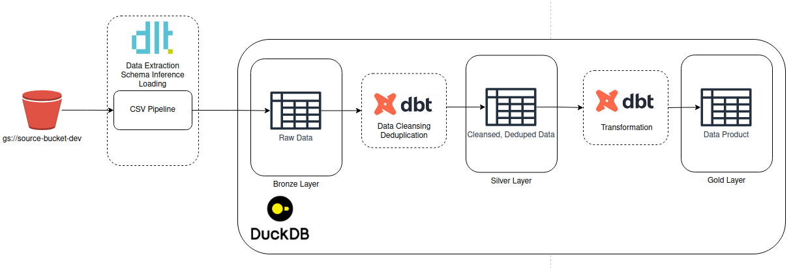
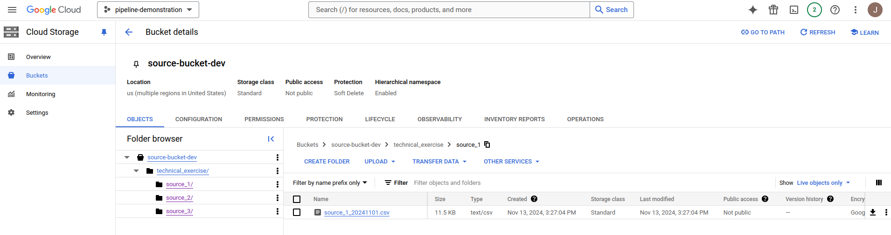
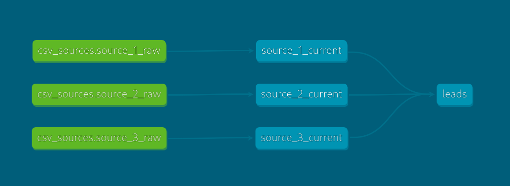

## Design
This design relies heavily on using the technologies [dlt](https://dlthub.com/), [dbt](https://www.getdbt.com/), and [DuckDB](https://duckdb.org/) 

The current design for the project is shown in the below architecture diagram:



dlt acts as the data extraction, schema inference, and loading tool from csv stored in GCS into our database. Once the raw data is loaded into our database, we clean, dedupe, and transform it into data products using dbt.

## Installation and Configuration

The entire project is managed with the [uv](https://github.com/astral-sh/uv) python project management tool. Once you have installed uv, then install the project's dependencies into a local virtual environment by running:
```sh
uv sync
```

In your GCP account, we create the bucket `source-bucket-dev`. Within the bucket, create a folder structure like so, with each of the three source files in a folder structure as below:

```sh
technical_exercise/
├─ source_1/
│  ├─ source_1_20241101.csv
├─ source_2/
│  ├─ source_2_20241101.csv
├─ source_3/
│  ├─ source_3_20241101.csv
```

In the GCP console, it should look something like this:



Create a GCP Service account by following [the documentation](https://cloud.google.com/iam/docs/service-accounts-create) and grant it permissions to read files within the bucket `source-bucket-dev` and provide it with a key.

Create a new file named `.dlt/secrets.toml` with the following structure, and fill it out with the values of your Service Account credentials. Please see the [dlt documentation](https://dlthub.com/docs/dlt-ecosystem/verified-sources/filesystem/basic#get-credentials) for further details.

```sh
[sources.filesystem.credentials]
client_id = "client_id" # please set me up!
client_secret = "client_secret" # please set me up!
refresh_token = "refresh_token" # please set me up!
project_id = "project_id" # please set me up!
```

## Loading raw data into DuckDB using dlt
Running the pipeline involves two major processes: Loading the raw csv data from GCS into DuckDB using dlt; and then transformaing that raw data into a data product using dbt.

To run the dlt load through uv, run the following command:
```sh
uv run dlt_pipeline/leads_to_duckdb.py
```

This will load any new files it discovers in the gcs locations into DuckDB into the tables `raw.source_1_raw`, `raw.source_2_raw`, and `raw.source_3_raw`. dlt will keep track of files that have already been loaded and will normally not reload them again. Any new files will be appended to these raw tables, so in production we will have an append-only log of all loads in a single table. Schema changes in the csv are handled by dlt detecting these schema changes and adding new columns to the table.

## Transforming raw data into the leads data product using dbt

To run the dbt pipeline through uv, run the following command:
```sh
uv run dbt run --project-dir leads --profiles-dir leads -s leads
```

For each source, we clean and filter for data from only the most recent data file from dlt, using the _modification_date field (which sources from the modification date of the csv file in GCS).

Once each table has been cleaned, we union them together into the desired table structure for the assignment.

The dbt data lineage graph for the project is below:



You can see the automatically-generated dbt documentation website by running the following commands:
```sh
uv run dbt docs generate --project-dir leads --profiles-dir leads
uv run dbt docs serve --project-dir leads --profiles-dir leads
```

## Querying the final data product
We can access the data product through the DuckDB CLI as follows:
```sh
uv run duckdb leads.duckdb
```

And then from there we can query the data product using standard SQL queries:
```sql
SELECT * FROM main_gold.leads LIMIT 5;
```

## Discussion and Next Steps
I am not certain I implemented the specifications for the transformation correctly, and that I understood the business case based on the writeup. The specification said that phone would be the primary identifier - however I noticed in the datasets that there were only a small number of phone numbers that were duplicated, and each of those cases appeared to be for a different facility. 

Each file only appears to implement a portion of the columns in the final data product. I spent a long time trying to find scenarios where the same entity was represented in multiple files, but I was unable to discover one. In that hypothetical scenario, I would want to join across the files to have a single canonical row for that entity in the data product. However, as no cases exist in this dataset, it is sufficient for now to just union all three files together to create the data product. I would request from the product owner for examples where we do have the same entity in different files, so I can correctly develop a join between them.


Due to the limitations of the 2-hour time limit, I was unable to implement several critical areas of functionality before we would ship to production:
- Each file did not come with a data dictionary, so I am uncertain if my mapping of each file's column to the data product's column is correct. I would seek a confirmation with the product owner of the behavior before shipping this to production. Additionally, due to time constraints I was not able to implement all the mappings correctly - an example is parsing out the address components of source_1's address field correctly.
- I was unable to create any unit or integration tests given the timeline. 
- I was not able to add data healthchecks in dbt due to limitations of time, as well as requiring additional context of each data element to understand the invariants present in the datasets. Implementing this would allow us to check for data health issues in production during runs.
- I was not able to implement an orchestration layer due to time constraints. In production, I would recommend that we implement a dedicated scheduling and orchestration tool such as Airflow to manage the runs of this process.
- I would like to add alerting and monitoring to this process. For example, you may notice in the dlt code that it prints alert messages whenever dlt detects a schema change. I would like this to be enhanced so that an alert message is emitted to slack or another tool so that engineers know immediately if there is a schema change in production. Similarly, I would like other health issues with the pipeline to generate alerts.
- While this proof of concept utilizes DuckDB as a cheap analytic lhttps://duckdb.org/ayer in development, in production I would be more comfortable using a tool like Snowflake / Redshift / BigQuery. Fortunately, dbt can dynamically change the SQL dialect it uses at runtime so changes should be minimal when that occurs. Ideally, all that would need to be changed is a connection to the Data Warehouse in prod in `leads/profiles.yml`
